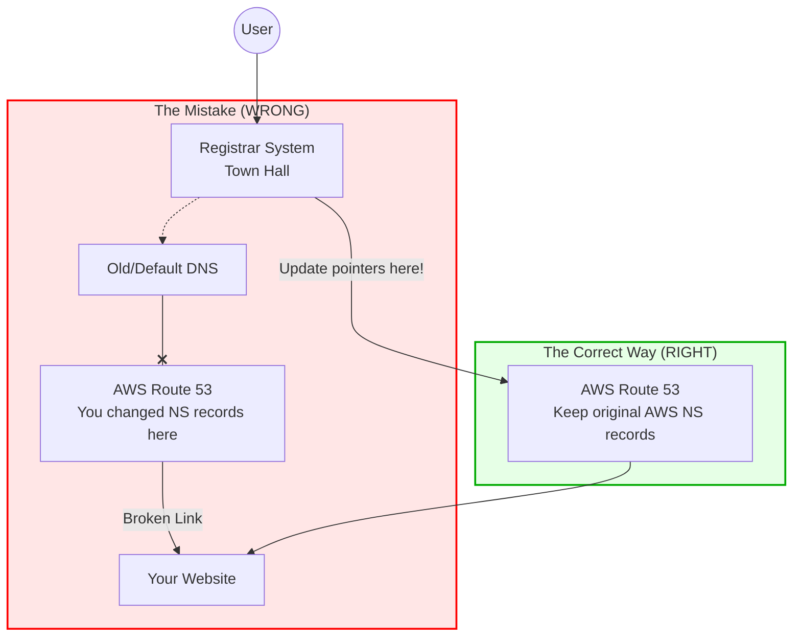

Hi friends! 👋

Welcome back to our **AWS for Newbies** series! Today, we are going to talk about a "silent killer" of websites: **The Domain Name Server (DNS) Setup Mistake**.

It sounds technical, but I promise to explain it so simply that even your 7-year-old cousin (or your cat 🐱) could understand it.

## The Scenario

Imagine you just bought a shiny new domain name, like `my-awesome-shop.com`, from a registrar like **GoDaddy** or **Namecheap**. This is where you _own_ the name.

Now, you want to manage your website using **AWS Route 53** because you are building a cool cloud app. You create a "Hosted Zone" in AWS.

Now you have two things:

1.  **The Registrar** (where you bought the name).
2.  **AWS Route 53** (where you want to manage the traffic).

You need to connect them. But **who points to whom?**

## The Big Mistake ❌

Many beginners look at their Route 53 settings, see a list of strange server names (like `ns-123.awsdns-01.com`), and think:

> _"Oh, these look different from what is in my GoDaddy account! I should change these AWS records to match GoDaddy!"_

**STOP! Don't do that!** 🛑

If you change the records inside AWS to match your Registrar, your website will break. It’s like buying a new house but putting your _old_ address on the new mailbox. The mailman (the internet) still goes to the old house.

## The "Phone Book" Analogy 📖

Let's imagine the Internet is a giant city.

- **The Registrar (GoDaddy/Namecheap):** This is the **Town Hall**. They keep the master list of who lives where. When someone asks, "Where is `my-awesome-shop.com`?", the Town Hall checks their list to see which **Phone Book** to use.
- **Route 53:** This is your personal **Phone Book**. It contains the specific directions (IP addresses) to your website, your email, and your database.

### Why the Mistake Fails

If you change the names _inside_ Route 53 (your Phone Book) to match the Registrar, you aren't telling the Town Hall anything new. The Town Hall still thinks, "Oh, look at the default GoDaddy Phone Book."

You effectively wrote "GoDaddy" on the cover of your AWS book, but the Town Hall never looks at your AWS book in the first place!

### The Correct Way ✅

You must go to the **Town Hall (Registrar)** and tell them:

> _"Hey! Stop looking at your old default book. Please look at **THIS** specific AWS Phone Book instead."_

You need to copy the AWS server names and paste them into your Registrar's settings.

## Visualizing the Fix

Here is a simple diagram to show the flow of authority.

