Hello fellow cloud explorers! 🚀

Welcome back to **AWS for Newbies**! Today, we are tackling a topic that sounds super boring but is actually a secret superhero protecting your internet life: **CORS**.

Have you ever tried to load an image or a font on your website, and it just refuses to show up, and your browser console yells something red and scary like this?

> *“Access to fetch at '...' has been blocked by CORS policy”* 😱

Let's decode this mystery in a way even a 7-year-old can understand.

## The Golden Rule: "Stranger Danger" (SOP)

Before we understand CORS, we need to understand the rule it breaks.

Imagine the internet is a giant neighborhood. Every website lives in its own **House**.

* Your house address is your **Origin**.
* An origin looks like this: `https://` + `my-awesome-site.com`

The web browser (like Chrome or Firefox) is your overprotective bodyguard. It has a strict rule called the **Same-Origin Policy (SOP)**.

**Here is how SOP works:**
Your browser says: "If you are in House A (`my-awesome-site.com`), you can play with toys inside House A. But you are **NOT allowed** to just reach into House B (`google.com`) and grab their toys without asking."

### Why do we need this rule? 🤔

Imagine you are logged into your online bank bank website. Then, you open a new tab and visit a malicious website, `super-evil-hackers.net`.

Without the SOP rule, the evil website could secretly tell your browser: *"Hey, while you are logged into the bank in that other tab, send me $500!"* The browser would do it because it trusts *you*.

SOP stops this. It stops "strangers" (different origins) from touching your private stuff in other tabs.

Here is a diagram of the browser blocking a "stranger":

```mermaid
flowchart LR
    subgraph Browser
        WebsiteA[🏠 Your Website<br/>(Origin A)]
        EvilSite[😈 Evil Website<br/>(Origin B)]
    end
    
    Bank[🏦 Your Bank<br/>(Origin C)]

    WebsiteA -- "Can access" --> WebsiteA
    EvilSite -- "❌ SOP BLOCKED! ❌<br/>Cannot touch Bank!" -.- > Bank

    style EvilSite fill:#ffe6e6,stroke:#ff0000
    style Bank fill:#e6ffe6,stroke:#00aa00
```

### Enter CORS: The "Permission Slip"
SOP is great for security, but sometimes it's annoying.

What if House A and House B are best friends? What if my-awesome-site.com needs to fetch a cool image stored on my-image-bucket.com?

They are different origins, so the browser bodyguard says "NOPE!" 🛑

This is where CORS comes in. It stands for Cross-Origin Resource Sharing.

Here is how CORS works: CORS is like a Permission Slip signed by the parents.

Your website (House A) tries to get an image from another server (House B).

Your browser sees this and gets suspicious. Before handing over the image, the browser politely asks House B: "Excuse me, House A wants this image. Do they have permission?"

House B checks its rules. If it likes House A, it sends back a special "header" (the permission slip) that says: Access-Control-Allow-Origin: * (Everyone is okay!) or Access-Control-Allow-Origin: https://my-awesome-site.com (Only friends are okay!).

The browser sees the slip and lets the image through. ✅

```mermaid
sequenceDiagram
    participant Browser 🛡️
    participant MySite as 🏠 My Website (Origin A)
    participant OtherServer as 🏢 Other Server (Origin B)

    Note over Browser, OtherServer: The CORS Handshake 🤝

    MySite->>Browser: I need data from Origin B!
    Browser->>OtherServer: 🗣️ "Hey, Origin A wants your data. Is that okay?"
    
    alt Permission Granted
        OtherServer-->>Browser: ✅ "Yes! Here is my Permission Slip header."
        Browser-->>MySite: Okay, here is the data.
    else Permission Denied
        OtherServer--xBrowser: ❌ "NO. I don't know them."
        Browser--xMySite: 🔥 CORS ERROR! Blocked.
    end
```



## The Sneaky Trick: Browser Extensions 🕵️‍♀️
You asked: How can a browser extension bypass CORS?

Great question!

Remember, SOP and CORS are rules enforced by the browser for regular web pages.

A browser extension (like an AdBlocker or a password manager) doesn't live on a web page. It lives inside the browser itself. It's like giving someone the master keys to the house.

Extensions have special privileges. They can tell the browser, "Shhh, ignore those rules for a second, I'm an administrator." This allows them to make requests to any server they want, ignoring CORS completely.

## Real-World Use Case: AWS S3 CORS ☁️
This is the most common place newbies face this mistake!

Let's say you built a beautiful website, https://cool-cat-pics.com. You decide to store all your cat photos in an AWS S3 Bucket because it's cheap and fast.

Your S3 bucket gets its own address, like https://my-cat-bucket.s3.amazonaws.com.

Uh oh! Do you see the problem?

Your Website Origin: cool-cat-pics.com

Your Bucket Origin: ...s3.amazonaws.com

They are different! When your site tries to load the cat photos, the browser blocks them. Broken images everywhere. 😿

## The Fix
You need to go into your AWS S3 console, find your bucket, go to the "Permissions" tab, and scroll down to CORS.

You need to add a "Permission Slip" (a JSON configuration) telling the bucket it's okay to talk to your website.

It looks something like this (simplified):

```json
[
    {
        "AllowedOrigins": [
            "[https://cool-cat-pics.com](https://cool-cat-pics.com)" 
        ],
        "AllowedMethods": [
            "GET"
        ],
        "MaxAgeSeconds": 3000,
        "AllowedHeaders": [
            "*"
        ]
    }
]
```

This config tells S3: "If cool-cat-pics.com asks to GET a photo, say YES!"

## Summary
SOP (Stranger Danger): The browser rule that stops different websites from talking to each other for security.

CORS (Permission Slip): The way servers tell the browser it's okay to break the SOP rule for specific friends.

S3 Needs CORS: Because your bucket and your website are usually two different "houses" on the internet.

Keep practicing, and don't fear the red error messages! 🦸‍♂️🦸‍♀️
